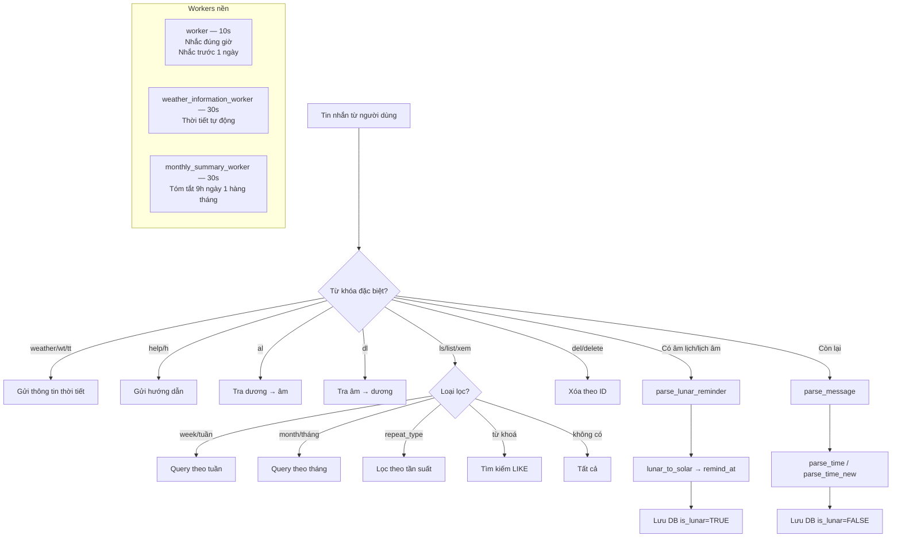

# Telegram Bot Reminder

Bot nhắc lịch cá nhân qua Telegram, hỗ trợ **lịch dương**, **lịch âm**, **thời tiết**, và **tóm tắt lịch định kỳ**.

---

## Mục lục

- [Telegram Bot Reminder](#telegram-bot-reminder)
  - [Mục lục](#mục-lục)
  - [Kiến trúc tổng thể](#kiến-trúc-tổng-thể)
  - [Cài đặt \& Chạy](#cài-đặt--chạy)
  - [Biến môi trường](#biến-môi-trường)
  - [Cơ sở dữ liệu](#cơ-sở-dữ-liệu)
  - [Cú pháp lệnh](#cú-pháp-lệnh)
    - [Thêm reminder](#thêm-reminder)
    - [Xem danh sách](#xem-danh-sách)
    - [Xóa reminder](#xóa-reminder)
    - [Tra cứu lịch âm/dương](#tra-cứu-lịch-âmdương)
    - [Thời tiết](#thời-tiết)
  - [Logic xử lý chính](#logic-xử-lý-chính)
    - [Khởi động \& Migration](#khởi-động--migration)
    - [Nhận diện \& phân tích câu lệnh](#nhận-diện--phân-tích-câu-lệnh)
    - [Parse thời gian dương lịch](#parse-thời-gian-dương-lịch)
    - [Parse thời gian âm lịch](#parse-thời-gian-âm-lịch)
    - [Lịch âm – thuật toán chuyển đổi](#lịch-âm--thuật-toán-chuyển-đổi)
    - [Worker nhắc nhở](#worker-nhắc-nhở)
    - [Worker thời tiết tự động](#worker-thời-tiết-tự-động)
    - [Worker tóm tắt đầu tháng](#worker-tóm-tắt-đầu-tháng)
  - [Sơ đồ luồng xử lý](#sơ-đồ-luồng-xử-lý)

---

## Kiến trúc tổng thể

```
main.py
 └── telegrambot.run()
      ├── init()              — load .env, kết nối DB, chạy migrate
      ├── ApplicationBuilder  — python-telegram-bot v20
      ├── Handlers
      │    ├── /start, /help
      │    ├── /list (/ls)
      │    ├── /delete (/del)
      │    └── MessageHandler  → add_reminder()  (xử lý toàn bộ text)
      └── Background workers (asyncio.create_task)
           ├── worker()                  — vòng lặp nhắc lịch mỗi 10 giây
           ├── weather_information_worker() — thời tiết tự động hàng ngày
           └── monthly_summary_worker()     — tóm tắt lịch 9h ngày 1 hàng tháng
```

**Stack:**

| Thành phần | Công nghệ |
|---|---|
| Bot framework | python-telegram-bot 20.7 (async) |
| Database | MySQL 8 |
| ORM/Driver | mysql-connector-python |
| Lịch âm | lunarcalendar.py (Ho Ngoc Duc 2004) |
| Parse thời gian | dateparser + dateutil.relativedelta |
| Timezone | `ZoneInfo("Asia/Ho_Chi_Minh")` |
| Triển khai | Docker Compose (2 service: `bot` + `db`) |

---

## Cài đặt & Chạy

```bash
# 1. Tạo file .env (xem mục Biến môi trường)
cp .env.example .env

# 2. Build và chạy
docker compose up -d --build

# 3. Xem log
docker compose logs -f bot
```

> **Lần đầu** Docker tự chạy `mysql-init/01-init.sql` (tạo bảng + index).  
> **Các lần sau** `migrate()` trong code tự thêm cột mới bằng `ALTER TABLE ... ADD COLUMN IF NOT EXISTS`.

---

## Biến môi trường

| Biến | Mô tả | Ví dụ |
|---|---|---|
| `BOT_TOKEN` | Token Telegram Bot | `123456:ABC-DEF...` |
| `DB_HOST` | Host MySQL | `db` |
| `DB_USER` | User MySQL | `root` |
| `DB_PASSWORD` | Password MySQL | `secret` |
| `DB_NAME` | Database name | `reminder_bot` |
| `TIME_INFORMATION` | Giờ gửi thời tiết tự động (`HH:MM`) | `06:30` |
| `OPENWEATHER_API_KEY` | API key OpenWeatherMap | `abc123...` |
| `DEFAULT_CITY` | Thành phố mặc định thời tiết | `Ho Chi Minh` |

---

## Cơ sở dữ liệu

**Bảng `reminders`:**

```sql
CREATE TABLE reminders (
    id           INT AUTO_INCREMENT PRIMARY KEY,
    user_id      BIGINT,                    -- Telegram user ID
    message      TEXT,                      -- Nội dung nhắc
    remind_at    DATETIME,                  -- Thời điểm nhắc (dương lịch)
    repeat_type  VARCHAR(20),               -- none | daily | weekly | monthly | yearly | every_Nd | every_Nw | every_Nm | every_Ny
    is_active    BOOLEAN DEFAULT TRUE,
    is_lunar     BOOLEAN DEFAULT FALSE,     -- Có phải nhắc theo âm lịch không
    lunar_day    TINYINT UNSIGNED,          -- Ngày âm lịch gốc
    lunar_month  TINYINT UNSIGNED,          -- Tháng âm lịch gốc
    lunar_year   SMALLINT UNSIGNED,         -- Năm âm lịch gốc
    lunar_leap   BOOLEAN DEFAULT FALSE,     -- Tháng nhuận
    created_at   TIMESTAMP DEFAULT CURRENT_TIMESTAMP
);
```

**Index:** `idx_remind_at`, `idx_active`, `idx_active_remind`

---

## Cú pháp lệnh

### Thêm reminder

```
Nội dung lúc/at/vào <thời gian> [<tần suất>]
<thời gian> Nội dung [<tần suất>]
```

**Dạng thời gian được hỗ trợ:**

| Cú pháp | Ví dụ |
|---|---|
| Giờ đơn giản | `14h`, `14:30`, `14.30`, `2h chiều` |
| Hôm nay / ngày mai | `lúc 9h hôm nay`, `lúc 8h mai` |
| Thứ trong tuần | `Thứ 4 14h`, `T4, 14.00`, `T4-14h` |
| **Giờ trước, thứ sau** | `10h T3 Họp với đối tác`, `14h30 T5 Nộp báo cáo` |
| Thứ viết tắt | `T2` → `T7`, `Chủ nhật` |
| Ngày cụ thể | `02/05/2026 8h` |
| Thời gian tương đối | `30 phút nữa`, `2 giờ nữa` |
| Âm lịch | Thêm `âm lịch` hoặc `lịch âm` vào câu |

> Nếu không nhập giờ → mặc định **9:00**.  
> Dạng thời gian-đứng-đầu tự động nhắc **sớm hơn 15 phút** so với giờ nhập.

**Tần suất lặp cố định:**

| Từ khóa | Nghĩa |
|---|---|
| `hàng ngày` / `daily` | Mỗi ngày |
| `hàng tuần` / `weekly` | Mỗi tuần |
| `hàng tháng` / `monthly` | Mỗi tháng |
| `hàng năm` / `yearly` | Mỗi năm |

**Tần suất lặp tuỳ ý:**

| Từ khóa | Nghĩa |
|---|---|
| `mỗi N ngày` | Lặp mỗi N ngày bất kỳ (ví dụ: `mỗi 25 ngày`) |
| `mỗi N tuần` | Lặp mỗi N tuần bất kỳ |
| `mỗi N tháng` | Lặp mỗi N tháng bất kỳ (ví dụ: `mỗi 4 tháng`) |
| `mỗi N năm` | Lặp mỗi N năm bất kỳ (ví dụ: `mỗi 2 năm`) |

Hỗ trợ cả dạng `lặp lại mỗi N ...` và tiếng Anh `every N days/weeks/months/years`.

> **Tần suất tuỳ ý áp dụng đầy đủ cho cả lịch âm.**  
> Bot tự tính đúng ngày dương lịch tương ứng với ngày âm sau N tháng/N năm, cập nhật lại DB.

**Ví dụ dương lịch:**

```
Họp với team lúc 3h chiều hàng ngày
T4, 14.00 Họp rà soát kế hoạch
10h T3 Họp với đối tác
14h30 T5 Nộp báo cáo hàng tuần
Làm dự toán vào 8h ngày 02/05/2026 hàng tháng
Khám định kỳ lúc 9h ngày 15/07/2026 mỗi 6 tháng
Uống thuốc lúc 8h hôm nay mỗi 3 ngày
Gia hạn domain lúc 9h ngày 05/06/2027 mỗi 2 năm
```

**Ví dụ âm lịch:**

```
Giỗ ông nội lúc 8h ngày 15/3 âm lịch hàng năm
Cúng rằm tháng 7 lúc 9h âm lịch hàng năm
Giỗ cụ lúc 8h ngày 10/2 âm lịch mỗi 1 năm
Cúng tổ lúc 9h ngày 15/3 âm lịch mỗi 3 năm
Cúng mùng 1 lúc 6h tháng giêng âm lịch mỗi 6 tháng
```

---

### Xem danh sách

| Lệnh | Kết quả |
|---|---|
| `ls` / `list` | Tất cả reminder |
| `ls daily` / `ls hàng ngày` | Lọc theo tần suất |
| `ls today` / `ls hôm nay` | Reminder hôm nay chưa nhắc |
| `ls week` / `ls tuần` | Lịch tuần hiện tại |
| `ls month` / `ls tháng` | Lịch tháng hiện tại |
| `ls <từ khoá>` | Tìm kiếm theo nội dung |

Có thể dùng bằng `/ls`, `/list` hoặc gõ trực tiếp vào chat.

---

### Xóa reminder

```
del <ID>
delete <ID>
/del <ID>
/delete <ID>
```

---

### Tra cứu lịch âm/dương

| Lệnh | Kết quả |
|---|---|
| `al` | Ngày âm lịch hôm nay |
| `al 15/3/2026` | Chuyển dương → âm |
| `dl 15/3/2026` | Chuyển âm → dương |

---

### Thời tiết

| Lệnh | Kết quả |
|---|---|
| `weather` / `wt` / `tt` | Thời tiết thành phố mặc định |
| `wt Hà Nội` | Thời tiết + dự báo ngày mai theo thành phố |

---

## Logic xử lý chính

### Khởi động & Migration

```
run()
 ├── init()
 │    ├── load_dotenv()
 │    ├── mysql.connector.connect(...)
 │    └── migrate()  — ALTER TABLE ADD COLUMN IF NOT EXISTS (5 cột lunar)
 └── app.run_polling()
```

`migrate()` chạy mỗi lần khởi động, an toàn khi chạy nhiều lần.

---

### Nhận diện & phân tích câu lệnh

`add_reminder()` là handler chính cho tất cả tin nhắn text. Thứ tự xử lý:

```
1. weather / wt / tt          → gọi weatherAPI
2. wt <city>                  → thời tiết theo thành phố
3. help / h                   → send_help()
4. al [date]                  → tra dương → âm
5. dl <date>                  → tra âm → dương
6. ls / list / xem / ...      → liệt kê reminder
   ├── ls today / ls hôm nay  → hôm nay, chưa nhắc
   ├── ls week / ls tuần      → lọc theo tuần hiện tại
   ├── ls month / ls tháng    → lọc theo tháng hiện tại
   ├── ls <repeat_type>       → lọc theo tần suất
   └── ls <từ khoá>           → tìm kiếm
7. del/delete <ID>            → xóa reminder
8. Phát hiện "âm lịch/lịch âm" → parse_lunar_reminder()
9. Còn lại                    → parse_message() → thêm reminder dương lịch
```

---

### Parse thời gian dương lịch

**`parse_message(text)`**

1. Tách `repeat_type` bằng regex.
2. Tìm từ nối `lúc / at / vào / @` để tách `message` và `time_part`.
3. Nếu không có từ nối → thử `parse_message_timefirst()` (dạng thời gian đứng đầu).

**`parse_time(text)`** — các nhánh xử lý theo thứ tự ưu tiên:

```
1. "X phút nữa"        → now + X phút
2. "X giờ nữa"         → now + X giờ
3. "hôm nay"           → hôm nay + giờ
4. "mai"               → ngày mai + giờ
5. Thứ trong tuần      → tính ngày thứ N gần nhất
   - Bóc tách token thứ trước khi extract giờ (tránh "t6" → hour=6)
   - "tuần tới/sau"    → offset +1 tuần
   - Nếu ngày đã qua   → +7 ngày
6. Chỉ có giờ          → hôm nay/mai nếu đã qua
7. Fallback            → dateparser (vi + en)
```

**`extract_time(text)`:** tìm `HH[:h]MM` bằng regex, xử lý `sáng/chiều/tối`.

**`parse_message_timefirst(text)`:** regex pattern `^[thứ/Tx] [giờ] [nội dung]$`, nhắc sớm hơn 15 phút.

---

### Parse thời gian âm lịch

**`parse_lunar_reminder(text)`:**

```
1. Tách repeat_type
2. Xóa keyword "âm lịch / lịch âm"
3. _extract_lunar_date_parts()  — nhận diện:
   - "rằm tháng X"
   - "DD tháng MM" / "ngày DD tháng MM" / "mùng DD tháng MM"
   - "DD/MM[/YYYY]"
4. Xác định năm âm lịch (từ text hoặc năm hiện tại)
5. Tách giờ từ phần còn lại
6. Tách message (bỏ ngày/giờ/giới từ)
7. lunar_to_solar()  — convert sang dương lịch
   - Nếu ngày đã qua → thử năm sau
8. Xác nhận lại lunar_day/month/year/leap bằng solar_to_lunar()
9. Trả về (message, remind_time, repeat_type, lunar_day, lunar_month, lunar_year, lunar_leap)
```

---

### Lịch âm – thuật toán chuyển đổi

**File:** `lunarcalendar.py`  
**Nguồn:** Thuật toán Ho Ngoc Duc (2004), UTC+7.

| Hàm | Mô tả |
|---|---|
| `solar_to_lunar(dd, mm, yy)` | Dương → Âm, trả `(lunar_day, lunar_month, lunar_year, is_leap)` |
| `lunar_to_solar(ld, lm, ly, leap=False)` | Âm → Dương, trả `(dd, mm, yy)`, trả `(0,0,0)` nếu không hợp lệ |
| `_jd_from_date` / `_jd_to_date` | Chuyển đổi Julian Day Number |
| `_new_moon(k)` | Thời điểm trăng non thứ k |
| `_sun_longitude(jdn)` | Kinh độ mặt trời (xác định tiết Đông chí) |
| `_get_new_moon_day(k, tz)` | Ngày trăng non theo múi giờ |
| `_get_lunar_month11(yy, tz)` | Xác định tháng 11 âm lịch (để tính năm mới) |
| `_get_leap_month_offset(a11, tz)` | Tìm vị trí tháng nhuận trong năm |

---

### Worker nhắc nhở

**`worker(app)`** — vòng lặp mỗi **10 giây**:

```
1. Query: remind_at <= now AND is_active = TRUE
   → Gửi tin nhắc
   → Tính remind_at tiếp theo theo repeat_type:
      - daily      → +1 ngày
      - weekly     → +7 ngày
      - monthly    → lunar: lunar_to_solar(day, month+1, year) | dương: +1 tháng
      - yearly     → lunar: lunar_to_solar(day, month, year+1) | dương: +1 năm
      - every_Nd   → +N ngày
      - every_Nw   → +N tuần
      - every_Nm   → lunar: +N tháng âm lịch | dương: +N tháng
      - every_Ny   → lunar: +N năm âm lịch  | dương: +N năm
      - none       → is_active = FALSE

2. Query nhắc trước 1 ngày (monthly/yearly và every_*m/every_*y):
   DATE_SUB(remind_at, INTERVAL 1 DAY) trong cửa sổ 10 giây
   → Gửi thông báo "Nhắc trước 1 ngày"
```

---

### Worker thời tiết tự động

**`weather_information_worker(app)`** — vòng lặp mỗi **30 giây**:

- Gửi thời tiết khi `now.hour == TIME_INFORMATION.hour` và `now.minute == TIME_INFORMATION.minute`.
- Gửi **dự báo 7 giờ sáng** và **dự báo cả ngày** cho ngày mai.
- Biến `sent_date` tránh gửi trùng trong cùng một ngày.

---

### Worker tóm tắt đầu tháng

**`monthly_summary_worker(app)`** — vòng lặp mỗi **30 giây**:

- Kích hoạt khi `day == 1`, `hour == 9`, `minute == 0`.
- Biến `sent_month` (tuple `year, month`) tránh gửi trùng.
- Query: tất cả reminder có `remind_at` nằm trong tháng hiện tại.
- Format giống `ls` — có thứ, ngày dương lịch, dòng âm lịch nếu là reminder âm.
- Gửi đến từng `user_id` có reminder đang hoạt động.

---

## Sơ đồ luồng xử lý


