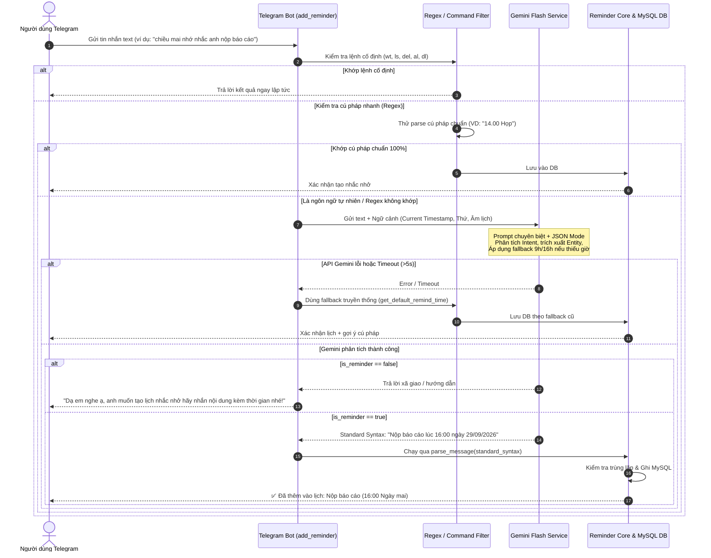

# Kế Hoạch Nâng Cấp Telegram Reminder Bot: Tích Hợp LLM Gemini Flash

Tài liệu này phân tích kiến trúc hiện tại, xác định khoảng trống nghiệp vụ và đề xuất lộ trình chi tiết để tích hợp Google Gemini Flash API vào Telegram Reminder Bot. Mục tiêu là cho phép bot hiểu ngôn ngữ tự nhiên tiếng Việt của người dùng, tự động chuẩn hóa về cú pháp chuẩn của hệ thống, và áp dụng quy tắc gợi ý giờ thông minh (9h sáng / 16h chiều) khi thiếu thông tin thời gian.

---

## 1. Hiện Trạng Codebase & Khoảng Trống Nghiệp Vụ (Gap Analysis)

### 1.1. Cơ chế phân tích tin nhắn hiện tại
Trong [`telegrambot.py`](file:///d:/Develop/Python/Telegram-bot-reminder/telegrambot.py), bot xử lý tin nhắn text qua hàm `add_reminder()` theo luồng tuần tự:
1. **Lệnh cố định:** Tra cứu thời tiết (`wt`), âm/dương lịch (`al`, `dl`), xem danh sách (`ls`), xóa lịch (`del`).
2. **Regex Parser:** 
   - Kiểm tra lịch âm: `parse_lunar_reminder(text)` dựa trên từ khóa âm lịch.
   - Kiểm tra nhiều mốc lặp: `parse_multi_reminder(text)`.
   - Kiểm tra chuẩn: `parse_message(text)` sử dụng separator (`at`, `lúc`, `vào`, `@`) hoặc mẫu thời gian đứng đầu (`parse_message_timefirst`).
3. **Fallback mặc định:** Nếu regex không khớp, bot coi **toàn bộ tin nhắn là nội dung công việc** và gọi hàm `get_default_remind_time()`:
   ```python
   # telegrambot.py
   now = datetime.now()
   if now.hour < 9:
       return now.replace(hour=9, minute=0, second=0, microsecond=0)
   elif now.hour < 16:
       return now.replace(hour=16, minute=0, second=0, microsecond=0)
   else:
       return (now + timedelta(days=1)).replace(hour=9, minute=0, second=0, microsecond=0)
   ```

### 1.2. Những hạn chế khi người dùng chat tự nhiên
| Tình huống người dùng | Phản hồi của hệ thống hiện tại | Vấn đề phát sinh |
|---|---|---|
| *"Mai nhớ nhắc anh 10h sáng đi gặp đối tác nhé"* | Regex fail vì có tiền tố *"Mai nhớ nhắc anh"*, không đúng mẫu `nội dung lúc thời gian` | Bị fallback thành nội dung dài ngoằng, giờ bị gán sai theo `get_default_remind_time()` |
| *"Chiều mai đi bơi"* | Không có giờ cụ thể (`16h`, `17h`) | Regex fail, fallback có thể gán sai vào 9h sáng mai hoặc 16h hôm nay |
| *"Thứ sáu tuần này nộp báo cáo tài chính"* | Có ngày nhưng thiếu giờ | Không nhận diện được ngày thứ sáu trong tuần nếu không có giờ kèm theo |
| *"Chào em bot, hôm nay khỏe không?"* | Regex fail | **Tạo ra 1 reminder với nội dung "Chào em bot, hôm nay khỏe không?"** vào 16h hoặc 9h sáng hôm sau (False Positive) |
| *"Tối nay 8h nhắc em uống thuốc nhé"* | Từ ngữ khẩu ngữ đảo trật tự | Dễ bị parse sót nội dung hoặc không nhận diện được `tối nay 8h` |

---

## 2. Mục Tiêu & Yêu Cầu Nâng Cấp

1. **Tích hợp Gemini Flash API:**
   - Hỗ trợ model Gemini Flash thế hệ mới (Gemini 2.5 Flash / Gemini 2.0 Flash / Gemini 1.5 Flash - người dùng có thể cấu hình linh hoạt qua biến môi trường).
   - Sử dụng thư viện SDK chính thức `google-genai` hoặc gọi REST API async để đảm bảo non-blocking event loop của Telegram Bot.
2. **Hiểu ngôn ngữ tự nhiên & Trích xuất thông tin:**
   - Tự động nhận diện ý định (Intent Classification): Phân biệt rõ đâu là tin nhắn muốn tạo nhắc nhở (`is_reminder: true`), đâu là tin nhắn trò chuyện/hỏi đáp (`is_reminder: false`).
   - Lọc bỏ các từ râu ria: Bỏ *"nhớ nhắc anh"*, *"ê bot"*, *"giúp tao"*, *"nhé em"*, chỉ giữ lại nội dung cốt lõi của công việc.
3. **Convert ngược lại cú pháp chuẩn của Bot:**
   - Thay vì can thiệp trực tiếp vào việc insert DB với format mới, LLM sẽ chuyển đổi câu chat tự nhiên thành **chuỗi cú pháp chuẩn mà bot đã hỗ trợ** (ví dụ: `Gặp đối tác lúc 10:00 ngày 29/09/2026` hoặc `Cúng rằm lúc 09:00 ngày 15/08 âm lịch hàng năm`).
   - Sau đó đưa chuỗi chuẩn hóa này qua pipeline hiện có. Cách làm này giữ nguyên 100% tính ổn định của việc kiểm tra trùng lặp, tính toán chu kỳ lặp (daily, weekly, custom interval `every_Nd`), format thông báo và ghi DB.
4. **Quy tắc Fallback thời gian thông minh theo ngữ cảnh (9h sáng / 16h chiều):**
   - Khi người dùng chỉ nói ngày mà không nói giờ, hoặc nói chung chung, LLM & bộ lọc sẽ tự động điền mốc giờ thích hợp nhất:
     - **Việc cho buổi sáng / ngày mai / ngày trong tương lai:** Gợi ý **09:00 sáng**.
     - **Việc cho buổi chiều / cuối ngày làm việc:** Gợi ý **16:00 chiều**.
     - **Việc trong ngày hôm nay:**
       - Nếu chat trước 09:00: Nhắc lúc **09:00**.
       - Nếu chat từ 09:00 đến 15:59: Nhắc lúc **16:00** (trước khi hết ngày làm việc).
       - Nếu chat sau 16:00: Nếu không chỉ định "tối nay", tự động dời sang **09:00 sáng hôm sau**.
5. **Cơ chế chịu lỗi (Graceful Degradation):**
   - Nếu mất mạng, hết quota Gemini, hoặc API timeout: Tự động fallback về bộ Regex Parser hiện tại, bảo đảm bot không bao giờ bị dừng hoạt động (crash).

---

## 3. Kiến Trúc Luồng Xử Lý Đề Xuất (Architecture & Workflow)

### 3.1. Sơ đồ tuần tự (Sequence Diagram)



---

## 4. Đặc Tả Dữ Liệu & Prompt Engineering Cho Gemini Flash

### 4.1. Cung cấp ngữ cảnh thời gian thực (Context Injection)
Để mô hình hiểu chính xác các từ tương đối như *"hôm nay"*, *"ngày mai"*, *"thứ 5 tuần này"*, *"cuối tuần"*, prompt luôn được inject ngữ cảnh:
```python
context = {
    "current_datetime": "2026-09-28 11:38:00",
    "weekday": "Thứ Hai",
    "current_lunar_date": "18/08/2026 (năm Bính Ngọ)"
}
```

### 4.2. Output Schema (Structured Output / JSON Mode)
Gemini Flash sẽ phản hồi theo cấu trúc JSON nghiêm ngặt:
```json
{
  "is_reminder": true,
  "confidence": 0.95,
  "original_intent": "create_reminder",
  "clean_message": "Nộp báo cáo tài chính quý 3",
  "standard_syntax": "Nộp báo cáo tài chính quý 3 lúc 16:00 ngày 02/10/2026",
  "extracted_time": {
    "date": "2026-10-02",
    "time": "16:00",
    "has_explicit_time": false,
    "fallback_applied": "afternoon_16h",
    "is_lunar": false
  },
  "repeat_type": "none",
  "explanation": "Người dùng yêu cầu nhắc nộp báo cáo vào thứ Sáu tuần này nhưng không nói giờ cụ thể, áp dụng fallback 16:00 chiều cuối ngày làm việc."
}
```

### 4.3. Ma trận quy tắc Fallback Thời Gian (Time Heuristics)
LLM được chỉ dẫn cụ thể qua System Instructions:
1. **Có giờ cụ thể:** Giữ nguyên giờ người dùng nói (ví dụ *"10h sáng"* -> `10:00`, *"4 rưỡi chiều"* -> `16:30`, *"tối 8h"* -> `20:00`).
2. **Chỉ nói buổi mà không có giờ:**
   - *"Sáng / buổi sáng"* -> `09:00`.
   - *"Trưa / đầu giờ chiều"* -> `13:30`.
   - *"Chiều / cuối ngày / tan làm"* -> `16:00`.
   - *"Tối"* -> `20:00`.
3. **Không nói giờ lẫn buổi (chỉ nói ngày: "ngày mai", "hôm nay", "thứ Sáu"):**
   - **Ngày tương lai:** Mặc định **09:00 sáng** (để người dùng chủ động đầu ngày).
   - **Hôm nay:**
     - Trước 09:00 sáng: Mặc định **09:00**.
     - Từ 09:00 đến 15:59: Mặc định **16:00 chiều** (nhắc xử lý trước khi kết thúc giờ hành chính).
     - Từ 16:00 trở đi: Chuyển sang **09:00 sáng ngày hôm sau**.
4. **Lịch âm (giỗ, rằm, mùng 1, Tết):**
   - Nếu không nói giờ, mặc định là **09:00 sáng** của ngày âm lịch đó.

---

## 5. Kế Hoạch Triển Khai Chi Tiết (Implementation Roadmap)

### Giai đoạn 1: Thiết lập Module & Cấu hình môi trường (Foundation)
- [ ] **Thư viện:** Bổ sung `google-genai` (hoặc `google-generativeai` / `httpx`) vào [`requirements.txt`](file:///d:/Develop/Python/Telegram-bot-reminder/requirements.txt).
- [ ] **Biến môi trường:** Cập nhật [`.env.example`](file:///d:/Develop/Python/Telegram-bot-reminder/.env.example) và [`.env`](file:///d:/Develop/Python/Telegram-bot-reminder/.env):
  ```env
  # ── Gemini LLM ──────────────────────────────────────────────────
  GEMINI_API_KEY=your_gemini_api_key_here
  GEMINI_MODEL=gemini-2.0-flash
  GEMINI_TIMEOUT_SECONDS=5
  LLM_FALLBACK_DEFAULT_MORNING_HOUR=09:00
  LLM_FALLBACK_DEFAULT_AFTERNOON_HOUR=16:00
  ```
- [ ] **Module mới `llm_service.py`:**
  - Viết class `GeminiReminderParser` chịu trách nhiệm giao tiếp với Google Gemini API.
  - Xây dựng prompt mẫu chặt chẽ (few-shot examples cho tiếng Việt).
  - Tích hợp async client để gọi không làm nghẽn bot.
  - Xử lý timeout và error handling (trả về `None` khi API lỗi để chuyển về fallback).

### Giai đoạn 2: Tích hợp vào Telegram Bot (`telegrambot.py`)
- [ ] Nạp cấu hình Gemini trong hàm `init()`.
- [ ] Cập nhật hàm `add_reminder(update, context)`:
  - Giữ nguyên các bộ lọc lệnh hệ thống (`weather`, `help`, `al`, `dl`, `ls`, `del`).
  - Kiểm tra xem tin nhắn có phải cú pháp ngắn gọn rõ ràng không (ví dụ `14.00 Họp`). Nếu đúng, xử lý ngay (tiết kiệm token và giảm độ trễ).
  - Nếu là ngôn ngữ tự nhiên: Gọi `llm_service.parse_natural_language_reminder(...)`.
  - Nếu `is_reminder == True`: Lấy `standard_syntax` đưa vào hàm parse hiện tại.
  - Nếu `is_reminder == False`: Gửi tin nhắn phản hồi thân thiện, tránh tạo reminder rác.
  - Nếu LLM gặp sự cố: Kích hoạt fallback regex truyền thống.

### Giai đoạn 3: Kiểm thử & Containerization
- [ ] **Cập nhật [`Dockerfile`](file:///d:/Develop/Python/Telegram-bot-reminder/Dockerfile):** Thêm `COPY llm_service.py .` vào Dockerfile.
- [ ] **Viết Unit Test / Script Test:** Tạo file `run_llm_test.py` kiểm tra các trường hợp:
  1. Câu có đầy đủ thông tin: *"Mai 10h nhắc anh đi công chứng"*
  2. Câu thiếu giờ (buổi chiều): *"Chiều mai nộp hồ sơ"* -> phải ra 16h
  3. Câu thiếu giờ (buổi sáng/ngày tới): *"Ngày mai nhớ mua quà sinh nhật"* -> phải ra 9h
  4. Câu âm lịch tự nhiên: *"Nhắc giỗ cụ ngày 15 tháng 3 âm lịch"*
  5. Câu lặp lại: *"Mỗi sáng 8h nhắc uống cà phê"*
  6. Câu không phải reminder: *"Hôm nay trời có mưa không em?"*, *"Cảm ơn bot"*
- [ ] **Cập nhật tài liệu [`README.md`](file:///d:/Develop/Python/Telegram-bot-reminder/README.md):** Bổ sung hướng dẫn lấy Gemini API key miễn phí từ Google AI Studio và các cú pháp tự nhiên được hỗ trợ.

---

## 6. Đánh Giá Rủi Ro & Giải Pháp Phòng Ngừa

| Rủi ro tiềm ẩn | Mức độ | Biện pháp phòng ngừa |
|---|---|---|
| **Độ trễ mạng (Latency):** Người dùng phải chờ lâu khi bot gọi API ngoài | Trung bình | - Dùng model **Gemini Flash** (thời gian xử lý chỉ ~300-500ms).<br/>- Đặt timeout tối đa 5 giây.<br/>- Đưa các cú pháp chuẩn vào Regex bắt trước để không tốn thời gian gọi LLM. |
| **Hết Quota / Lỗi mạng:** API Google bị gián đoạn | Thấp | - Bọc toàn bộ lệnh gọi LLM trong `try...except`.<br/>- Nếu API lỗi, tự động trôi xuống regex parser và `get_default_remind_time()` hiện tại, thông báo cho người dùng biết. |
| **Ảo giác ngày tháng (Hallucination):** LLM đoán sai năm hoặc thứ | Thấp | - Luôn truyền ngày, giờ, thứ hiện tại chính xác vào prompt.<br/>- Kiểm tra tính hợp lệ của ngày giờ sinh ra trước khi lưu vào DB. |
| **Chi phí gọi API:** | Rất thấp | - Gemini 1.5/2.0 Flash có gói Free Tier hào phóng (15 RPM, 1500 RPD), hoàn toàn đủ cho nhu cầu cá nhân hoặc nhóm nhỏ.<br/>- Các lệnh xem lịch (`ls`), xóa (`del`), tra cứu (`wt`, `al`, `dl`) không gửi qua LLM. |

---

## 7. Kết Luận & Đề Xuất Bước Kế Tiếp

Phương án nâng cấp này kết hợp tối ưu giữa **sức mạnh ngôn ngữ tự nhiên của Gemini Flash** và **sự ổn định, tin cậy của bộ máy nhắc lịch hiện có** trong `telegrambot.py`. Việc chuẩn hóa tin nhắn về cú pháp chuẩn của bot giúp code không bị phân mảnh và hoàn toàn tương thích với database MySQL hiện tại.

**Bước tiếp theo:** Sau khi anh duyệt qua bản kế hoạch này, ta có thể bắt đầu tiến hành triển khai Giai đoạn 1 (tạo `llm_service.py` và cấu hình môi trường).
